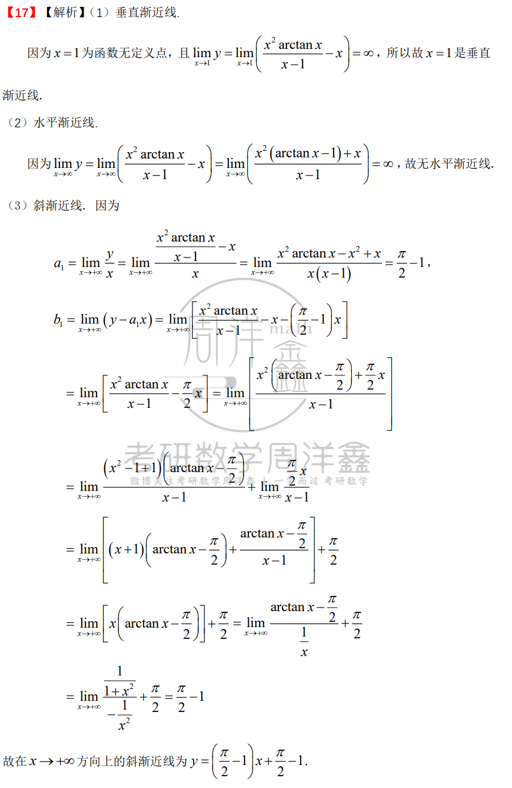

# 李永乐第一套

# 李林1

对于分母是ln(1+x^2) 的其他来说,仅影响x趋于0时候的敛散性 不影响趋于无穷的敛散性

另见李永乐2-2

参数的上下限随曲线积分方向变化

# 周洋鑫 4

A

B

C

C

234

$$
2\sqrt{\ln2}
$$

-24

35/24

# 周洋鑫 3

D 3234阶

B

A

D 不独立的判定

A

21题的配方法

# 周洋鑫 2

A 非常重要

3pi/4

函数可微的充要条件

# 周洋鑫 1

ABCA |-1/16 ||50

# 李永乐 2

两平面相交得到的曲线的方向向量是两平面法向量的叉乘(易证)

# 李永乐 3 

